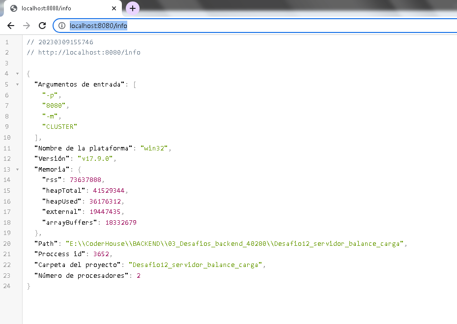
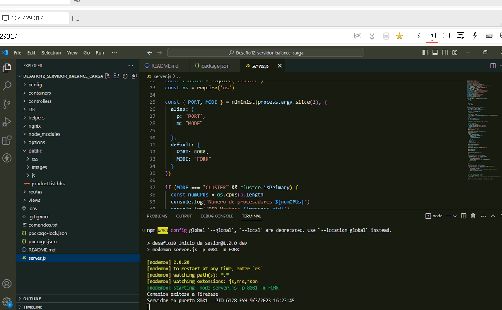
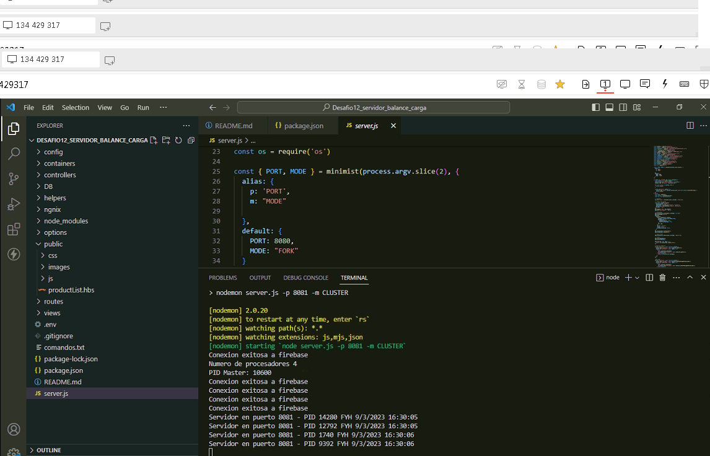
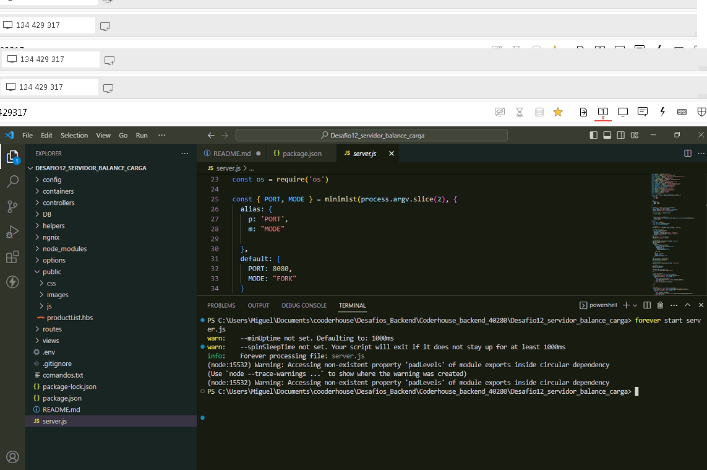
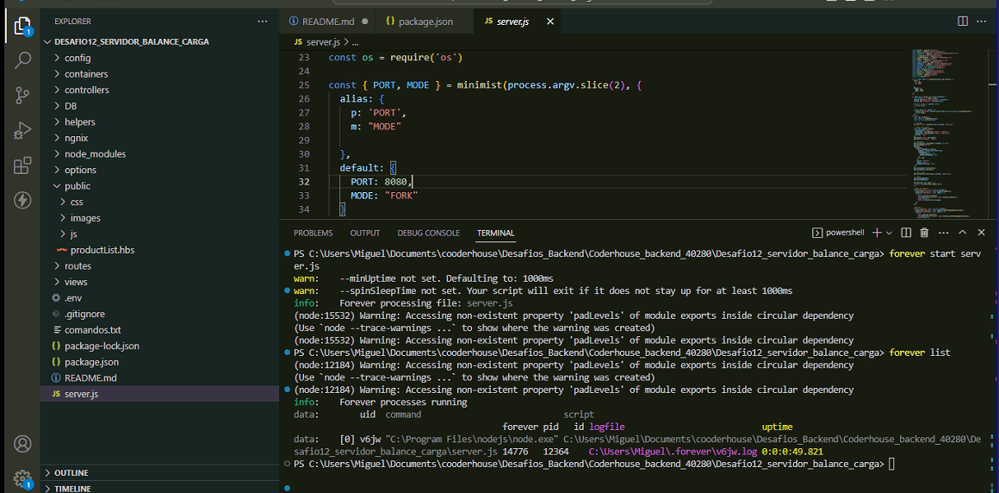
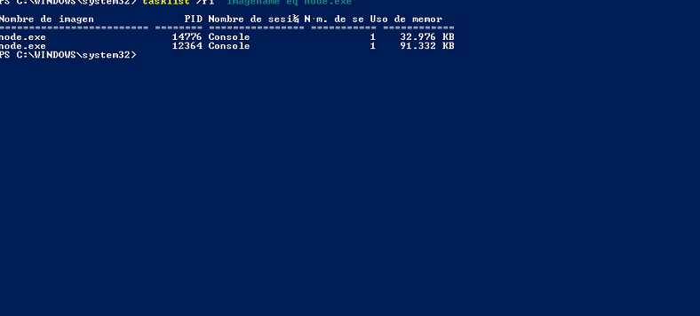
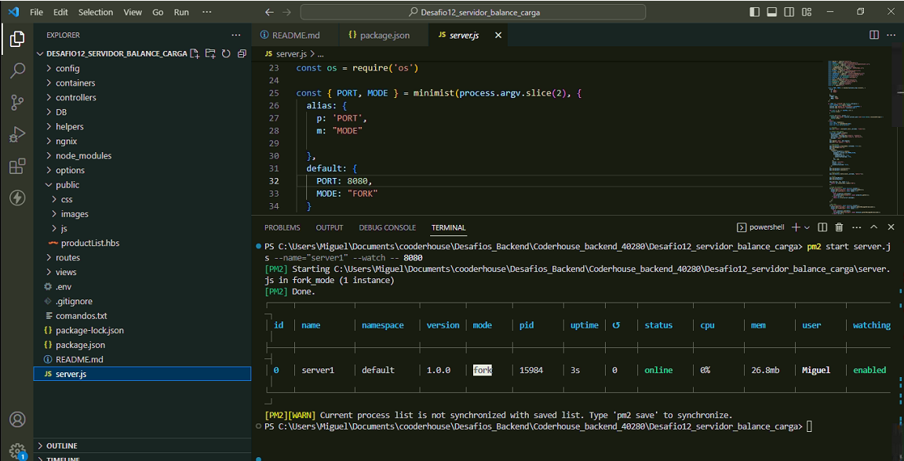
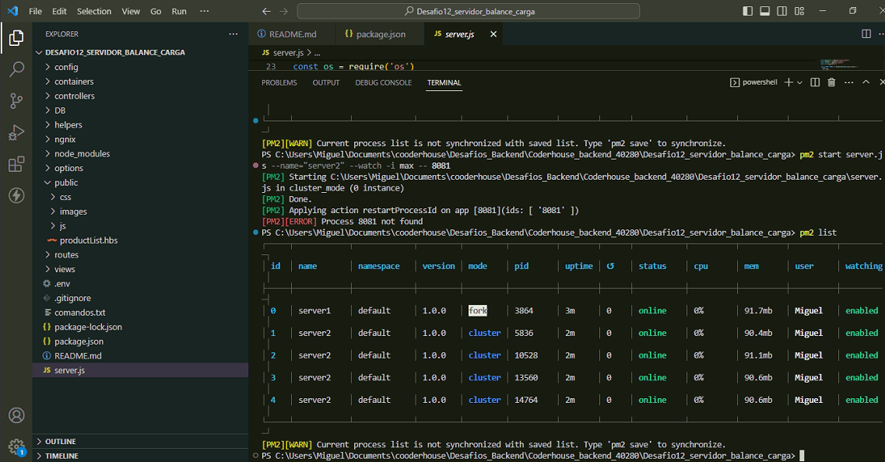

# EJECUTAR SERVIDORES NODE
Consigna:
Tomando con base el proyecto que vamos realizando, agregar un parámetro más en la ruta de comando que permita ejecutar al servidor en modo fork o cluster. Dicho parámetro será 'FORK' en el primer caso y 'CLUSTER' en el segundo, y de no pasarlo, el servidor iniciará en modo fork.
Agregar en la vista info, el número de procesadores presentes en el servidor.

Ejecutar el servidor (modos FORK y CLUSTER) con nodemon verificando el número de procesos tomados por node.

Ejecutar el servidor (con los parámetros adecuados) utilizando Forever, verificando su correcta operación. Listar los procesos por Forever y por sistema operativo.

Ejecutar el servidor (con los parámetros adecuados: modo FORK) utilizando PM2 en sus modos modo fork y cluster. Listar los procesos por PM2 y por sistema operativo.

Tanto en Forever como en PM2 permitir el modo escucha, para que la actualización del código del servidor se vea reflejado inmediatamente en todos los procesos.

Hacer pruebas de finalización de procesos fork y cluster en los casos que corresponda.

# SERVIDOR NGINX
Consigna:
Configurar Nginx para balancear cargas de nuestro servidor de la siguiente manera:
Redirigir todas las consultas a /api/randoms a un cluster de servidores escuchando en el puerto 8081. El cluster será creado desde node utilizando el módulo nativo cluster.

El resto de las consultas, redirigirlas a un servidor individual escuchando en el puerto 8080.

Verificar que todo funcione correctamente.

Luego, modificar la configuración para que todas las consultas a /api/randoms sean redirigidas a un cluster de servidores gestionado desde nginx, repartiéndolas equitativamente entre 4 instancias escuchando en los puertos 8082, 8083, 8084 y 8085 respectivamente.

Aspectos a incluir en el entregable:

Incluir el archivo de configuración de nginx junto con el proyecto.

Incluir también un pequeño documento en donde se detallen los comandos que deben ejecutarse por línea de comandos y los argumentos que deben enviarse para levantar todas las instancias de servidores de modo que soporten la configuración detallada en los puntos anteriores.

Ejemplo:
pm2 start ./miservidor.js -- --port=8080 --modo=fork
pm2 start ./miservidor.js -- --port=8081 --modo=cluster
pm2 start ./miservidor.js -- --port=8082 --modo=fork
...


## RESOLUCION DE DESAFIO

**Servidor modo FORK o CLUSTER**

```
const minimist = require('minimist')
const cluster = require("cluster")
const os = require('os')

const { PORT, MODE } = minimist(process.argv.slice(2), {
  alias: {
    p: 'PORT',
    m: "MODE"

  },
  default: {
    PORT: 8080,
    MODE: "FORK"
  }
})

if (MODE === "CLUSTER" && cluster.isPrimary) {  
  const numCPUs = os.cpus().length
  console.log(`Numero de procesadores ${numCPUs}`)
  console.log(`PID Master: ${process.pid}`)

  for (let i = 0; i < numCPUs; i++) {
    cluster.fork()
  }

  cluster.on("exit", worker => {
    console.log(`Worker ${worker.process.pid} died ${new Date().toLocaleString()}`)
    cluster.fork()
  })
} else {
  const app = express();
  const server = createServer(app);
  const io = new Server(server);

  //...
}

```

**Numero de procesadores en vista info**

Endpoint: http://localhost:8080/info



**Servidor modo FORK y CLUSTER con nodemon**

Comandos

```
nodemon server.js -p 8080 -m FORK

```



```
nodemon server.js -p 8081 -m CLUSTER

```



**Servidor modo FORK y CLUSTER con forever**

Comandos

```
forever start server.js
forever list
forever stoppall
```





**Servidor modo FORK y CLUSTER con PM2**

Comandos

```
pm2 start server.js name="server1" --watch -- 8081
pm2 start server.js name="server1" --watch -i max -- 8081
```




**Nginex /api/randoms puerto 8081 resto de consultas puerto 8080**

Archivo adjunto: ./nginex/nginex1.conf

```
events {
}

http {
    include       mime.types;
    default_type  application/octet-stream;

    upstream node_app {
        server 127.0.0.1:8080;
    }

    upstream node_app2 {
        server 127.0.0.1:8081;
    }

    server {
        listen       80;
        server_name  nginx_node;

        location /datos/ {
            proxy_pass http://node_app;
        }
        
        location /api/randoms {
            proxy_pass http://node_app2;
        }
    }
}
```

**Nginex /api/randoms consultas redirigidas a cluster**

Archivo adjunto: ./nginex/nginex2.conf

```
events {
}

http {
    include       mime.types;
    default_type  application/octet-stream;

    upstream node_app {
        server 127.0.0.1:8080;
    }

    upstream node_app2 {
        server 127.0.0.1:8082;
        server 127.0.0.1:8083;
        server 127.0.0.1:8084;
        server 127.0.0.1:8085;
    }

    server {
        listen       80;
        server_name  nginx_node;

        location /datos/ {
            proxy_pass http://node_app;
        }
        
        location /api/randoms {
            proxy_pass http://node_app2;
        }
    }
}
```
